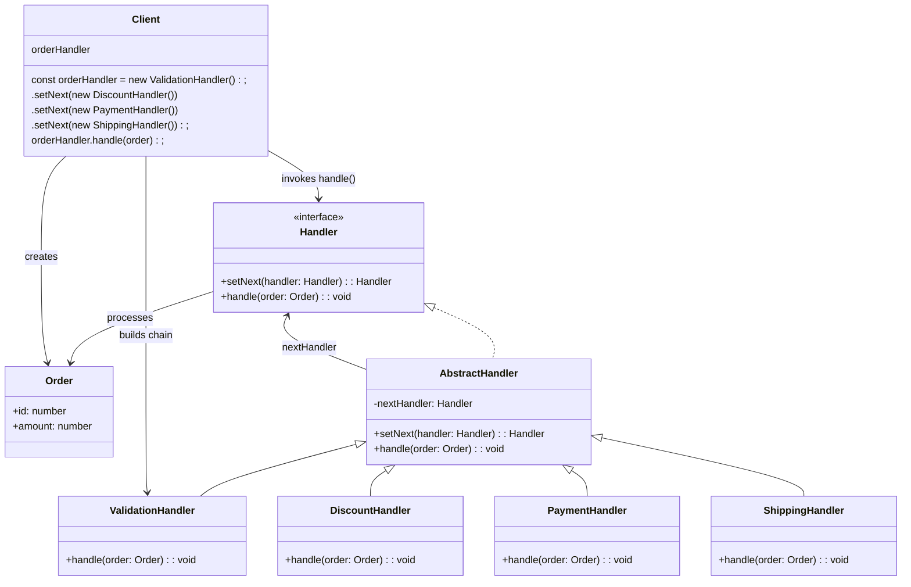
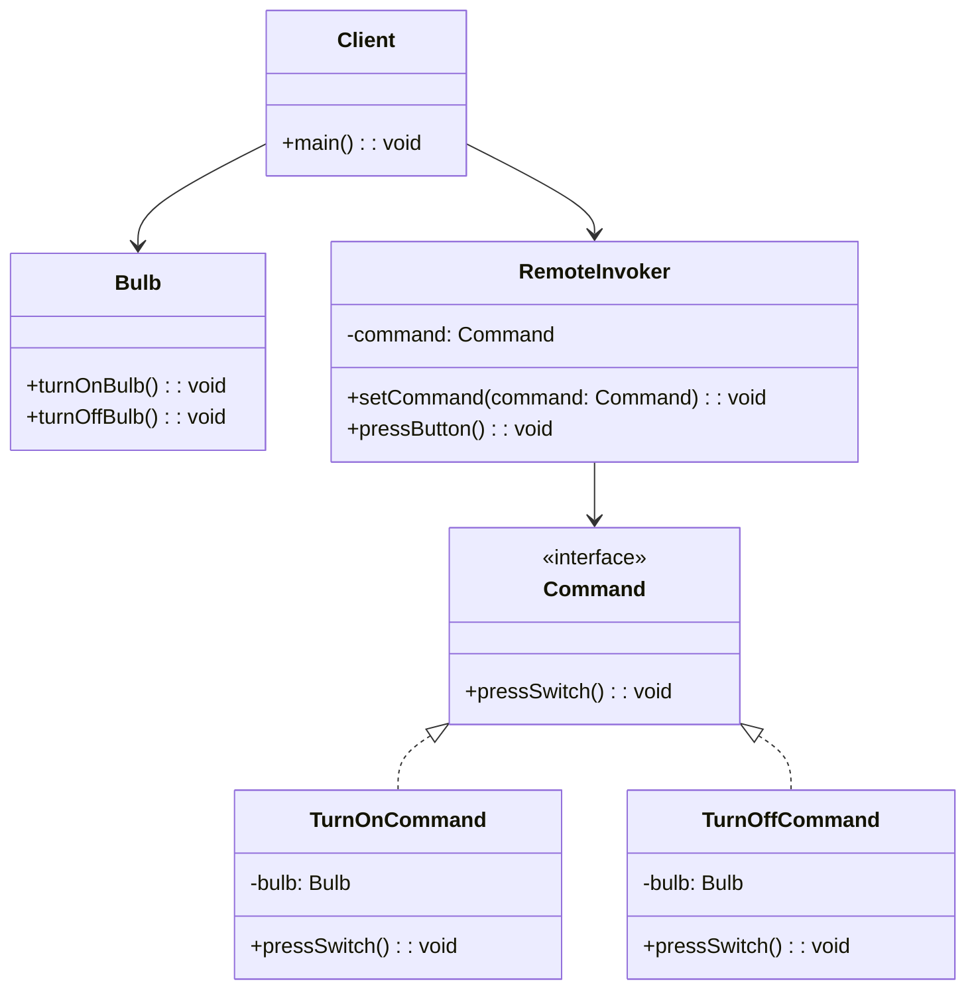
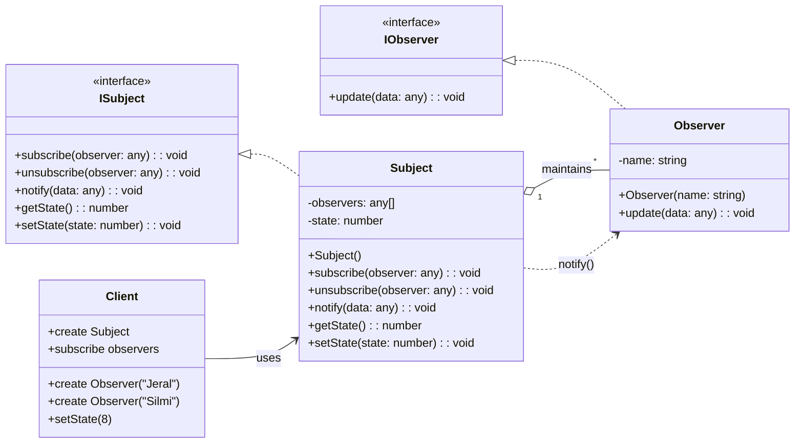
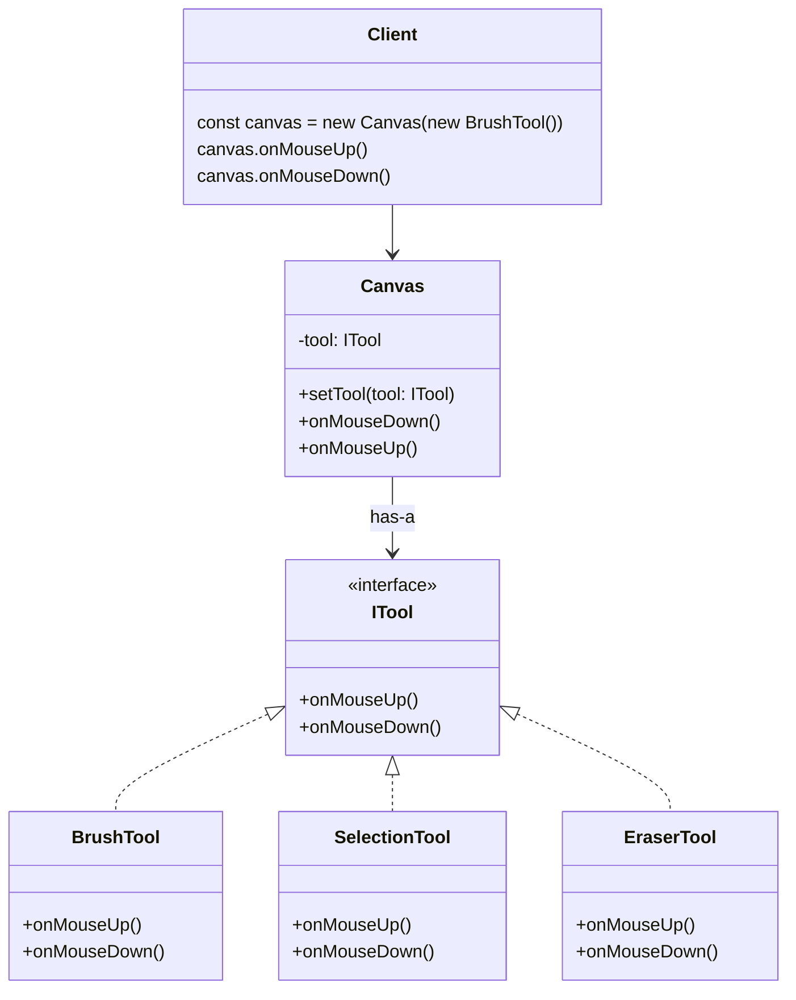
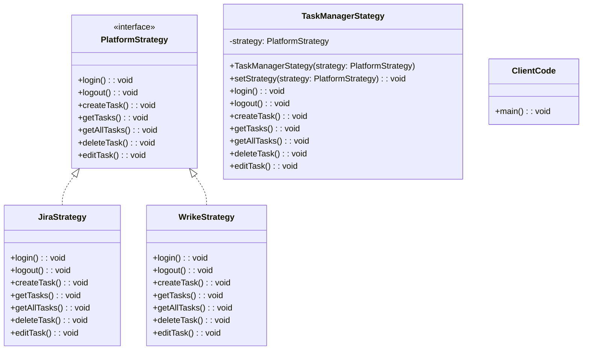
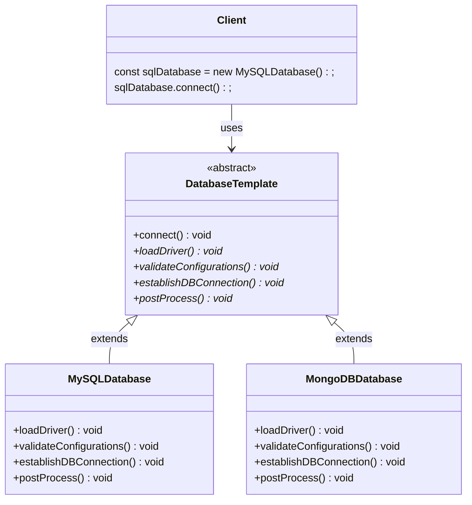

# Behavioural Patterns

---

## Chain of Responsibility

- Pass request along a chain until handled / Request goes throught handlers



---
<br />

## Command

- Give commands as objects / Encapsulates requests as objects
- Parameterize and queue actions



---
<br />

## Interpreter

- Define grammar and interpret sentences

```mermaid

```

---
<br />

## Iterator

- Sequentially access elements without exposing structure

```mermaid
classDiagram

%% Interfaces
class Iterator~T~ {
  <<interface>>
  +next() T | null
  +hasNext() boolean
}

%% Concrete Iterator
class NameIterator {
  -index: number
  -names: string[]
  +NameIterator(names: string[])
  +next() IteratorResult~string~
  +hasNext() boolean
}

%% Collection
class NameCollection {
  -names: string[]
  +add(name: string) void
  +getIterator() Iterator~string~
}

%% Client
class Client {
  +main() void
}

%% Relationships
Iterator <|.. NameIterator
NameCollection --> NameIterator : creates
Client --> NameCollection : uses
```

---
<br />

## Mediator

- Central object controls communication

```mermaid

```

---
<br />

## Memento

- Save and restore state
- Captures and restores object state

```mermaid
classDiagram

class Client {
  +main()
}

class History {
  -mementos: EditorMemento[]
  +push(memento: EditorMemento): void
  +pop(): EditorMemento | undefined
}

class Editor {
  -content: string
  +type(words: string): void
  +getContent(): string
  +save(): EditorMemento
  +restore(memento: EditorMemento): void
}

class EditorMemento {
  -content: string
  +EditorMemento(content: string)
  +getContent(): string
}

Client ..> Editor : creates & uses
Client ..> History : creates & uses

History *-- "0..*" EditorMemento : stores

Editor ..> EditorMemento : creates
Editor ..> EditorMemento : restores from
```

---
<br />

## Observer

- One-to-many dependency (notify on change)
- Notify observers on state change



---
<br />

## State

- Object behaviour change based on internal state



---
<br />

## Strategy

- Swap algorithms at runtime



---
<br />

## Template

- Define skeleton, subclasses fill steps / follow exact pattern



---
<br />

## Visitor

- Add new operations to structure

```mermaid

```

---
<br />
