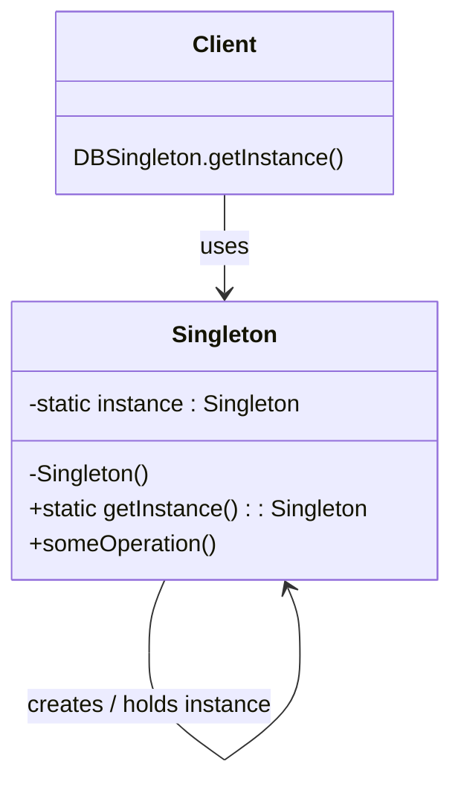
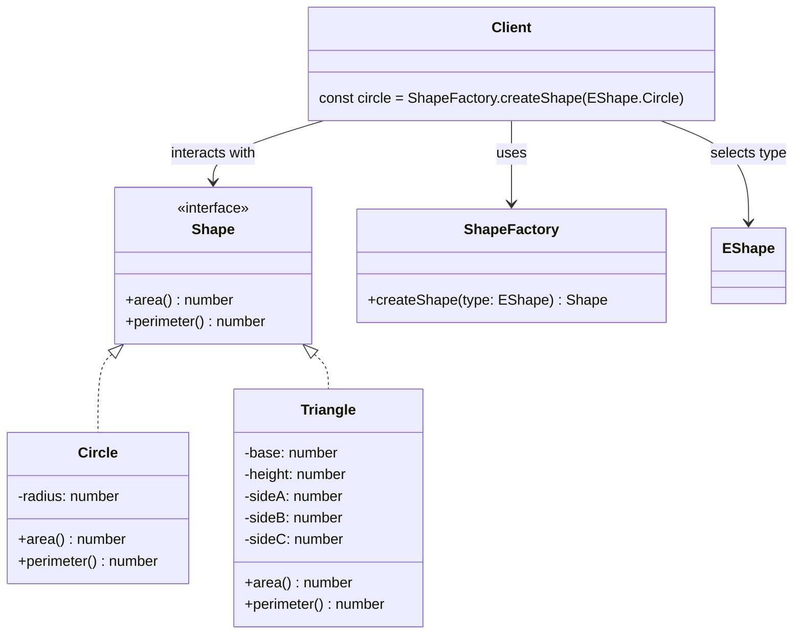
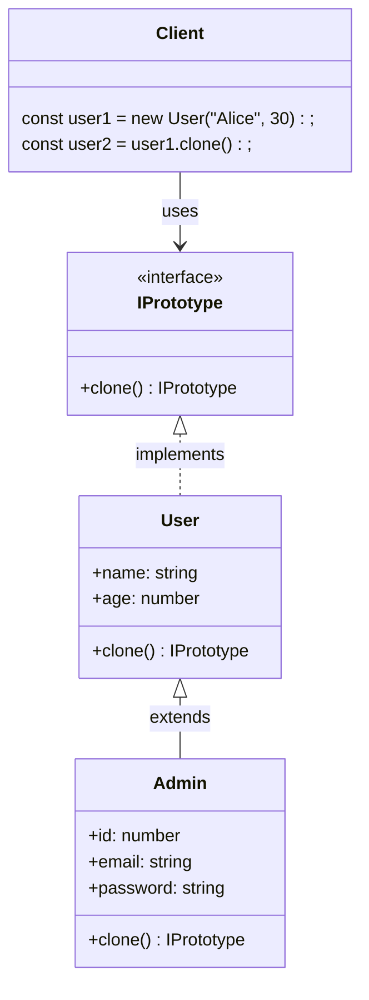

# Creational Patterns

---

## Singleton

- Ensures only one instance of a class exists
- Centralized access and control of shared resources



---
<br />

## Factory

- Subclasses decide which class to instantiate
- Delegates object creation



---
<br />

## Abstract Factory

- Creates families of related objects
- Ensures consistency

```mermaid

```

---
<br />

## Builder

- Constructs complex objects step by step
- Avoids constructor pollution

```mermaid
classDiagram

class Client {
    +main()
}

class ComputerDirector {
    +buildGamingComputer(builder: GamingComputerBuilder) Computer
    +buildOfficeComputer(builder: OfficeComputerBuilder) Computer
}

class ComputerBuilder {
    <<interface>>
    +setCPU(cpu: string) ComputerBuilder
    +setRAM(ram: number) ComputerBuilder
    +setStorage(storage: number, storageType: string) ComputerBuilder
    +build() Computer
}

class GamingComputerBuilder {
    -computer: Computer
    +setCPU(cpu: string) ComputerBuilder
    +setRAM(ram: number) ComputerBuilder
    +setStorage(storage: number, storageType: string) ComputerBuilder
    +build() Computer
}

class OfficeComputerBuilder {
    -computer: Computer
    +setCPU(cpu: string) ComputerBuilder
    +setRAM(ram: number) ComputerBuilder
    +setStorage(storage: number, storageType: string) ComputerBuilder
    +build() Computer
}

class Computer {
    +cpu: string
    +ram: number
    +storage: number
    +storageType: string
    +gpu: string
}

ComputerBuilder <|.. GamingComputerBuilder : is-a
ComputerBuilder <|.. OfficeComputerBuilder : is-a

GamingComputerBuilder --> Computer : builds
OfficeComputerBuilder --> Computer : builds

ComputerDirector --> ComputerBuilder

Client --> ComputerDirector
```

---
<br />

## Prototype

- Clone new objects out of existing objects instead of creating new objects
- Avoids costly object instantiation


