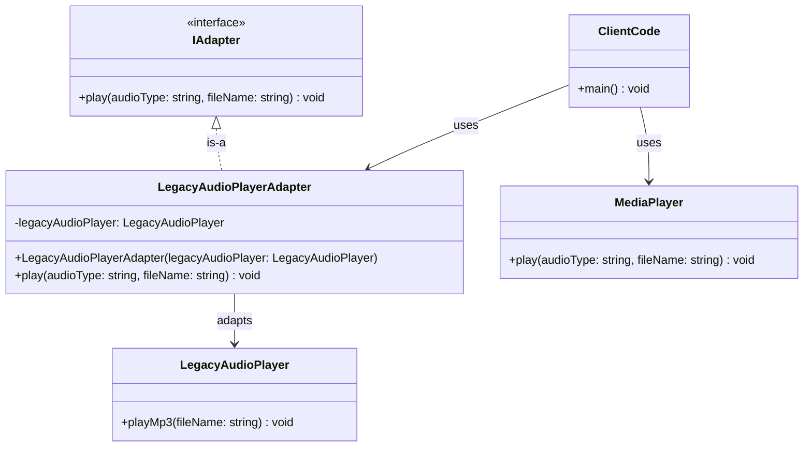
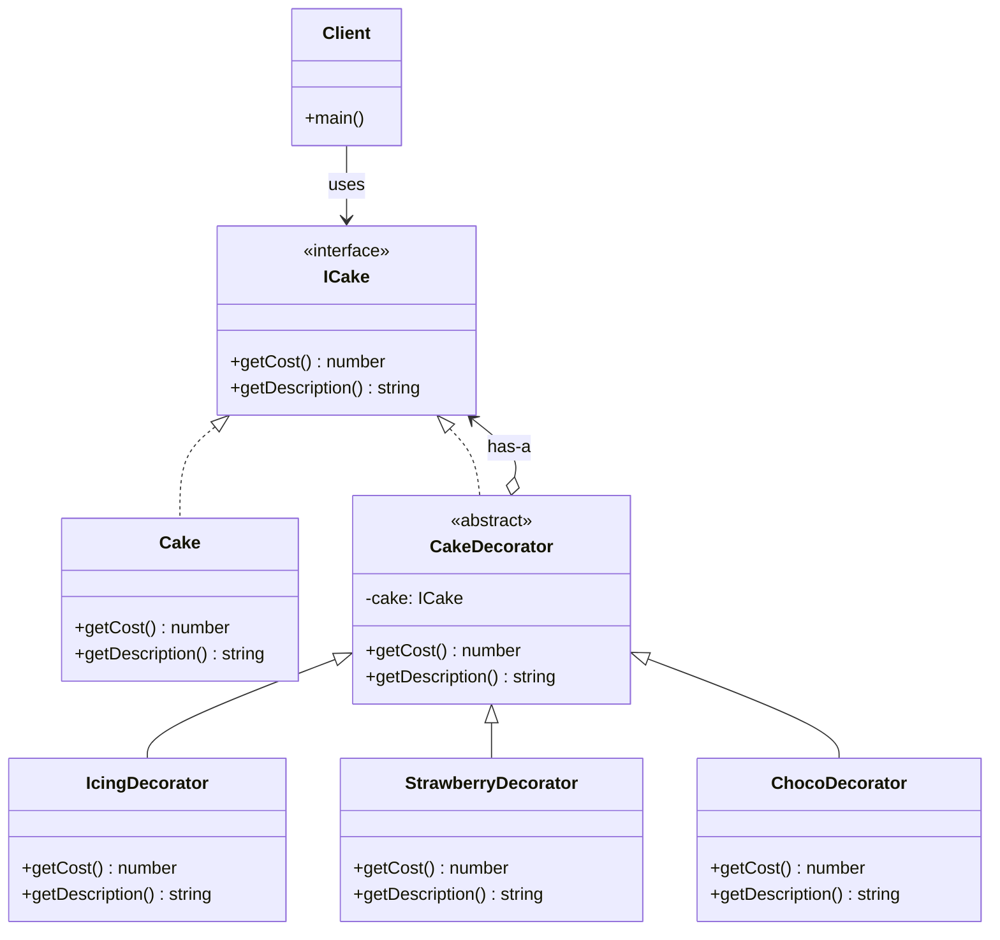
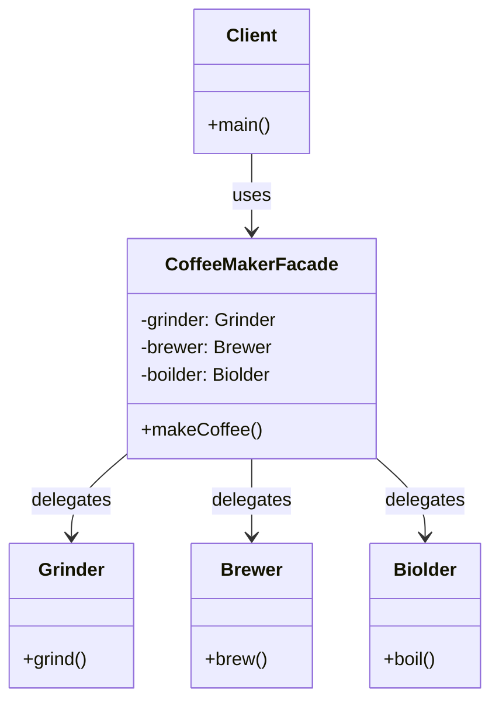
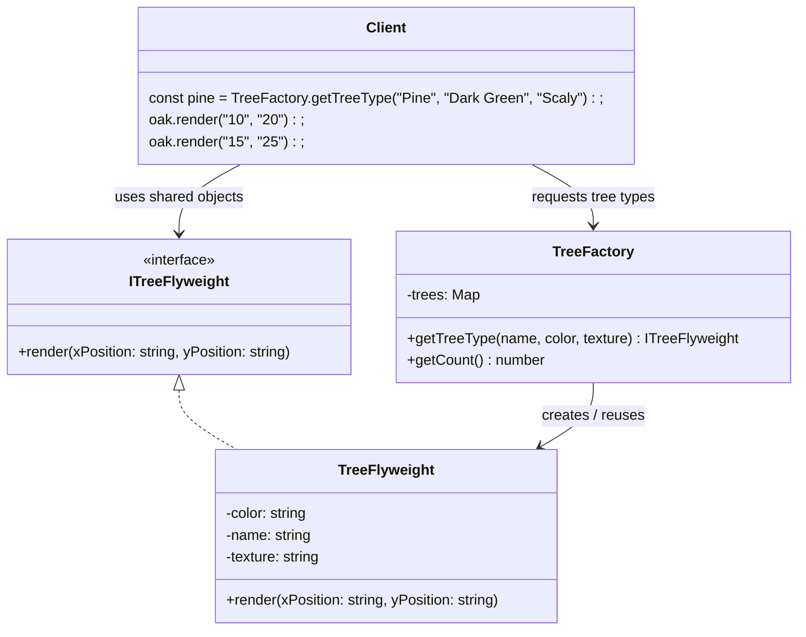
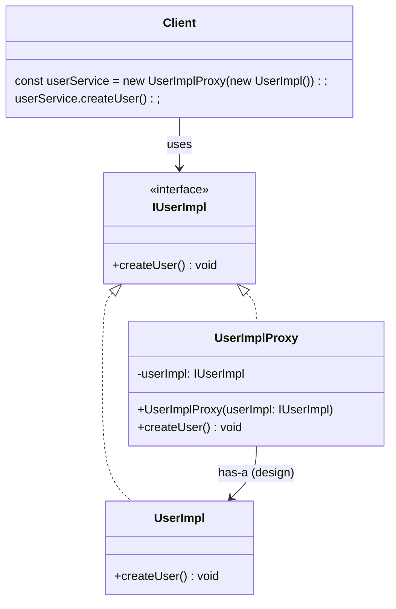

# Structural Patterns

---

## Adapter

- Bridges incompatible interfaces
- Make incompatible interfaces work together



---
<br />

## Bridge

- Separate abstractions from implementation and scale them independently

```mermaid

```

---
<br />

## Composite

- Tree structure for individual/group objects
- Treat individual and group objects the same

```mermaid
classDiagram

%% ===== Interfaces =====
class SystemComponent {
  <<interface>>
  +getName(): string
  +getSize(): number
}

class CompositeSystemComponent {
  <<interface>>
  +addFile(component: SystemComponent): void
  +removeFile(component: SystemComponent): void
  +getAllComponents(): SystemComponent[]
}

%% ===== Concrete Classes =====
class File {
  -name: string
  -size: number
  +getName(): string
  +getSize(): number
}

class Folder {
  -systemComponents: SystemComponent[]
  +addFile(component: SystemComponent): void
  +removeFile(component: SystemComponent): void
  +getAllComponents(): SystemComponent[]
  +getName(): string
  +getSize(): number
}

%% ===== Relationships =====
SystemComponent <|.. File
CompositeSystemComponent <|.. Folder
CompositeSystemComponent --> SystemComponent : has-a

%% ===== Client =====
class Client {
  +main(): void
}

Client --> SystemComponent
```

---
<br />

## Decorator

- Add responsibilities dynamically
- Add features dynamically without changing class / Add add-ons / Customization



---
<br />

## Facade

- Simplified interface to complex subsystems



---
<br />

## Flyweight

- Reuses shared objects to save memory
- High performance with many objects / Share common data to save memory



---
<br />

## Proxy

- Placeholder that controls access to real object
- Controls access to real object (Controls access to real object)



---
<br />
